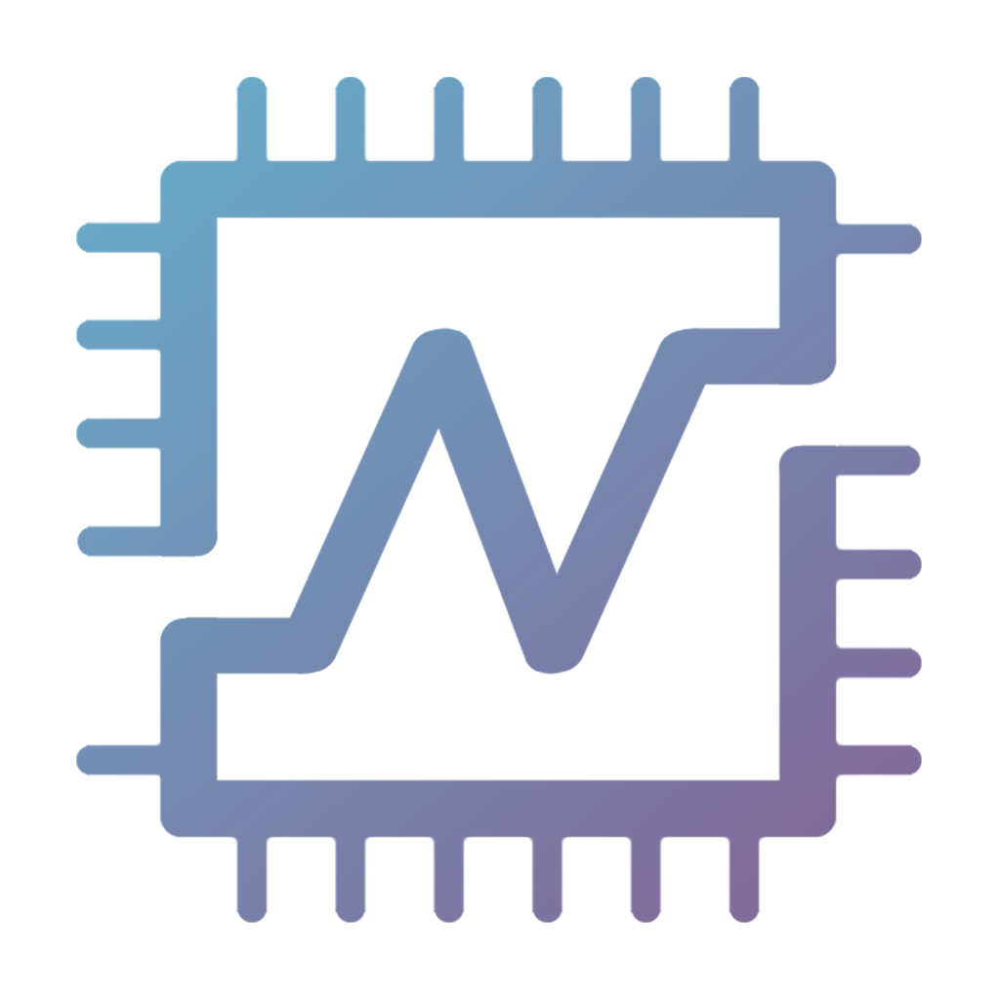

# Nerva Block Explorer

A modern, fast, and feature-rich block explorer for the [Nerva (XNV)](https://nerva.one) cryptocurrency a privacy-focused, CPU-minable coin built on Cryptonote technology.



## ✨ Features

- **Real-time Network Stats** — Live height, hashrate, difficulty, solve time, transactions, circulating supply, block reward, and database size, auto-refreshing every 15 seconds.
- **Interactive Charts** — Switch between Hashrate (area), Block Time (bars), and Difficulty (area) visualizations of the last 60 blocks, powered by Recharts.
- **Recent Blocks Table** — Browse the latest 60 blocks with height, timestamp, hash, size, transaction count, and reward. Filter between "All" or "With TXs".
- **Transaction Mempool** — View pending transactions waiting to be included in the next block, with fee, weight, and timestamp.
- **Detail Modal** — Click any block or transaction to see full details: hash, previous hash, miner tx, difficulty, cumulative difficulty, reward, size, weight, nonce, version, depth, orphan status — with copy-to-clipboard on every field.
- **Smart Search** — Search by block height (number), block hash (64-char hex), or transaction hash. The explorer auto-detects the type and opens the right modal.
- **Tools Section**
  - **Unit Converter** — Convert between XNV and atomic units (10¹² piconero).
  - **Mining Calculator** — Estimate expected time per block, blocks per day, and XNV rewards per day/week/month based on your hashrate.
  - **API Quick Start** — Copy-pasteable JavaScript snippet to get started with the Nerva RPC API.
  - **Useful Links** — Quick access to the website, docs, GitHub, Discord, mining calculator, and node map.
- **Dark / Light Mode** — Persisted in localStorage, with a smooth animated toggle. Respects system preference on first visit.
- **Fully Responsive** — Mobile-first design with a hamburger menu and stacked card layouts on small screens.

## 🛠 Tech Stack

- **Framework**: [Next.js 16](https://nextjs.org/) (App Router) with TypeScript 5
- **Styling**: [Tailwind CSS 4](https://tailwindcss.com/) with CSS variables for theming
- **Animations**: [Framer Motion](https://www.framer.com/motion/)
- **Charts**: [Recharts](https://recharts.org/)
- **Fonts**: Rubik (sans) + JetBrains Mono (hashes / code)
- **API**: Nerva RPC proxy at `https://api.nerva.one/daemon/explorer/index.php`

## 🚀 Getting Started

### Prerequisites

- Node.js 18.18+ (or [Bun](https://bun.sh/) 1.0+)
- A package manager: `npm`, `yarn`, `pnpm`, or `bun`

### Installation

```bash
# Clone the repo
git clone https://github.com/XelisVault/nerva-explorer.git
cd nerva-explorer

# Install dependencies
npm install
# or
bun install
```

### Development

```bash
npm run dev
# or
bun run dev
```

Open [http://localhost:3000](http://localhost:3000) in your browser. The page auto-reloads on file changes.

### Production Build

```bash
npm run build
npm start
```

### Lint

```bash
npm run lint
```

## 📁 Project Structure

```
nerva-explorer/
├── public/
│   └── explorer/            # Nerva logos + favicon
├── src/
│   ├── app/
│   │   ├── globals.css      # Design system + Tailwind theme
│   │   ├── layout.tsx       # Root layout (fonts, dark mode script)
│   │   └── page.tsx         # Main page assembling all sections
│   ├── components/
│   │   ├── explorer/
│   │   │   ├── header.tsx          # Sticky header with search + nav + theme toggle
│   │   │   ├── network-stats.tsx   # 8 live stat cards
│   │   │   ├── network-charts.tsx  # Hashrate / Block Time / Difficulty charts
│   │   │   ├── blocks-table.tsx    # Recent blocks table (desktop + mobile)
│   │   │   ├── mempool-table.tsx   # Transaction mempool
│   │   │   ├── detail-modal.tsx    # Modal for block & tx details
│   │   │   ├── tools.tsx           # Converter, calculator, API snippet, links
│   │   │   ├── footer.tsx         # Footer with link columns
│   │   │   └── icons.tsx          # Custom SVG icon set
│   │   └── ui/                    # shadcn/ui primitives (optional)
│   ├── hooks/
│   │   └── use-explorer-data.ts   # React hook polling the API every 15s
│   └── lib/
│       └── nerva-api.ts           # Nerva RPC client + helpers
├── package.json
├── tsconfig.json
├── tailwind.config.ts
├── next.config.ts
└── README.md
```

## 🌐 API Reference

The explorer consumes the official Nerva RPC proxy at:

```
https://api.nerva.one/daemon/explorer/index.php
```

### Endpoints used

| Endpoint | Description |
|---|---|
| `?endpoint=get_info` | Network info (height, difficulty, tx count, etc.) |
| `?endpoint=get_block_headers_range&start=N&end=M` | Block headers between two heights |
| `?endpoint=get_transaction_pool` | Pending transactions in the mempool |
| `?endpoint=get_generated_coins&height=N` | Total emitted coins at a given height (returns XNV, not atomic units) |
| `?endpoint=get_block_header_by_height&height=N` | Single block header |
| `?endpoint=get_block_header_by_hash&hash=H` | Single block header by hash |
| `?endpoint=get_transactions&hash[]=H` | Transaction details by hash |

### Quirks

- `get_block_headers_range` rejects ranges where `end >= current_height`. Use `end = height - 1`.
- `get_generated_coins` returns a plain number (e.g. `19244557.4794`), not a JSON object. Parsed with `parseFloat(text)`.
- The supply returned by `get_generated_coins` is already in XNV (not atomic units), unlike `block.reward` which is in atomic units (divide by 10¹²).

## 🎨 Design System

| Token | Light | Dark |
|---|---|---|
| Background | `#f8fafc` | `#0a0814` |
| Surface | `#ffffff` | `#1a1633` |
| Text | `#1e293b` | `#e6e3f5` |
| Accent | `#635891` (purple) | `#b9a5ff` |
| Brand teal | `#55a8bf` | `#5fc4dc` |
| Brand purple | `#635891` | `#9d8fd6` |

The palette is inspired by the original Nerva hero gradient (teal → purple).

## 🤝 Contributing

Pull requests are welcome! For major changes, please open an issue first to discuss what you'd like to change.

1. Fork the repository
2. Create a feature branch: `git checkout -b feat/my-feature`
3. Commit your changes: `git commit -m 'feat: add my feature'`
4. Push to the branch: `git push origin feat/my-feature`
5. Open a pull request

Please run `npm run lint` before submitting.

## 📝 License

This project is licensed under the MIT License — see the [LICENSE](LICENSE) file for details.

## 🙏 Credits

- **Original Vue explorer**: [nerva-project/nerva-explorer](https://github.com/nerva-project/nerva-explorer)
- **Nerva Project**: [nerva.one](https://nerva.one) · [docs.nerva.one](https://docs.nerva.one)
- Built with [Next.js](https://nextjs.org/), [Tailwind CSS](https://tailwindcss.com/), [Framer Motion](https://www.framer.com/motion/), and [Recharts](https://recharts.org/).

## 🔗 Links

- 🌐 [Nerva Website](https://nerva.one)
- 📚 [Documentation](https://docs.nerva.one)
- 🐙 [GitHub](https://github.com/nerva-project)
- 💬 [Discord](https://discord.com/invite/jsdbEns/)
- 🐦 [Twitter](https://twitter.com/NervaCurrency)
- 🗺️ [Node Map](https://map.nerva.one/)
- ⛏️ [Mining Calculator](https://nerva.one/nerva-mining-profitability-calculator/)
